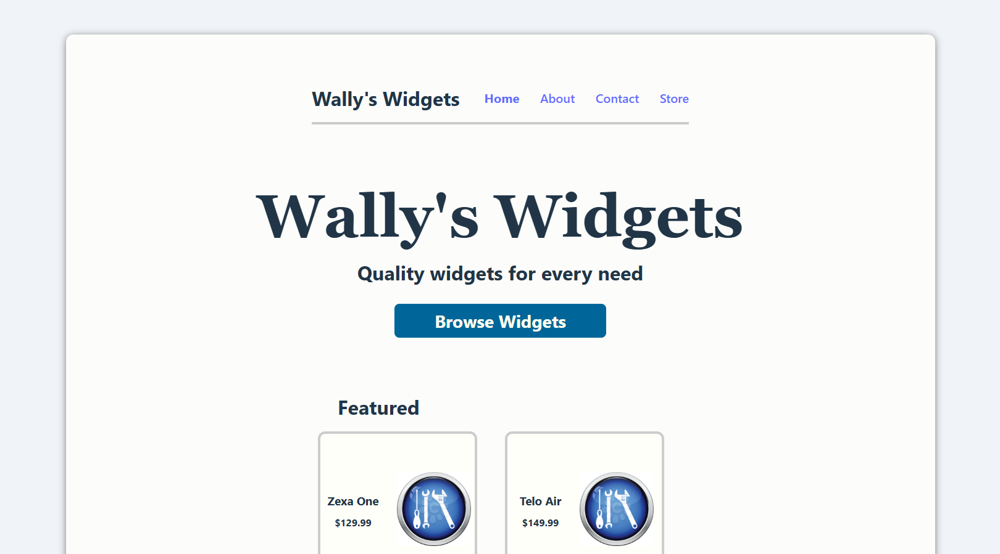
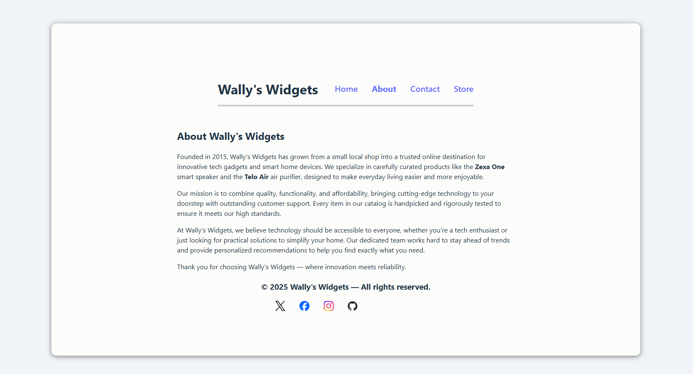
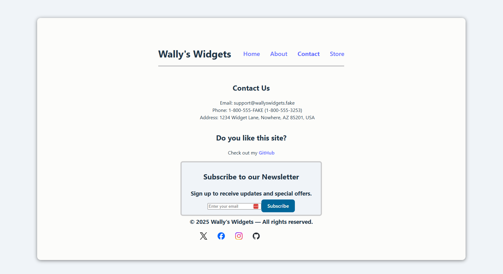
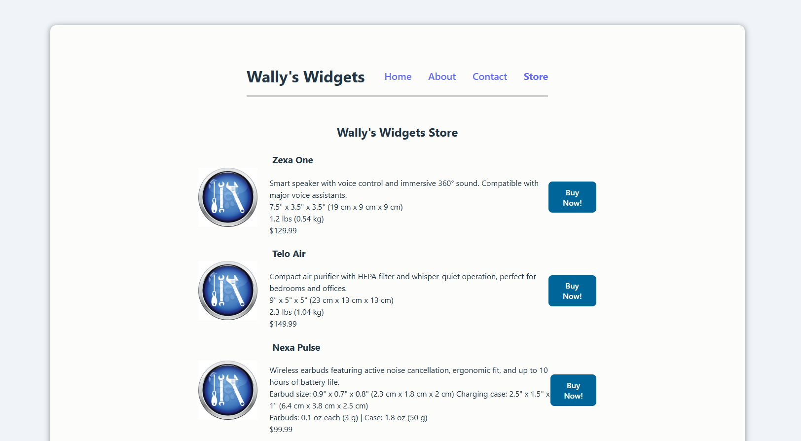

# Mock E-Commerce Site

A fictional e-commerce catalog built with **React**, designed to showcase products and act as a bridge to dedicated storefronts like Amazon or Shopify.  

This project also explores **lead generation workflows**, including contact capture and (planned) newsletter subscriptions.

---

## Features

- React-based frontend
- Product catalog UI

---

## Screenshots

### Home page

### About us page

### Contact us page

### Store page

---

## Planned Features

- End-to-end testing with **Playwright**
- Component testing with **Vitest** and **React Testing Library**
- Newsletter subscription system
- Lead generation via contact form
---

## Live Demo

Check out the deployed app here:  
https://mock-ecommerce-site-gamma.vercel.app/

---

## Notes

This project is intended as a **portfolio piece** and a sandbox for experimenting with:
- Frontend architecture
- Testing strategies
- User acquisition patterns
